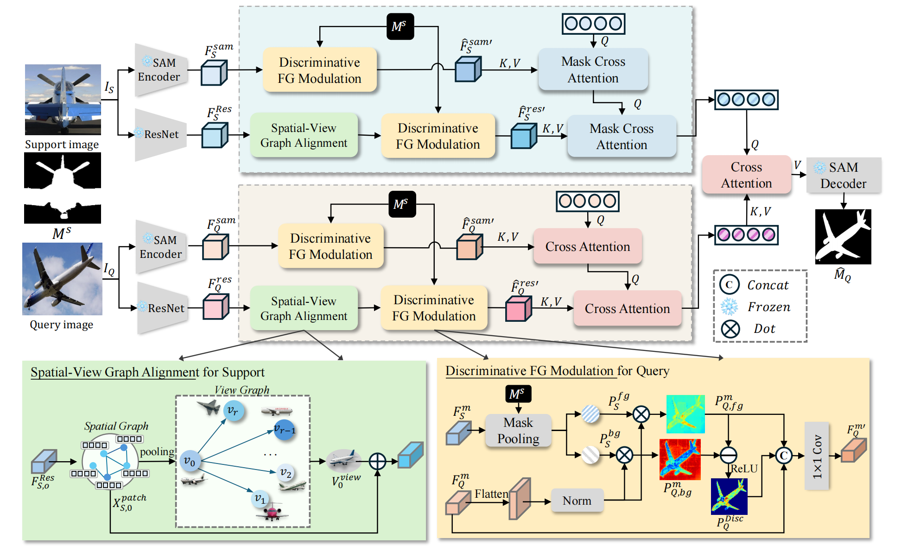

# Unify the Views: View-Consistent Prototype Learning for Few-Shot Segmentation

**Hongli Liu, Yu Wang<sup>*</sup>, Shengjie Zhao<sup>*</sup>**, "Unify the Views: View-Consistent Prototype Learning for Few-Shot Segmentation", CVPR finding,2026

> **Abstract:** Few-shot segmentation (FSS) has gained significant attention for its ability to generalize to novel classes with limited supervision, yet remains challenged by structural misalignment and cross-view inconsistency under large appearance or viewpoint variations. This paper tackles these challenges by introducing VINE (View-Informed NEtwork), a unified framework that jointly models structural consistency and foreground discrimination to refine class-specific prototypes. Specifically, VINE introduces a spatial–view graph on backbone features, where the spatial graph captures local geometric topology and the view graph connects features from different perspectives to propagate view-invariant structural semantics. To further alleviate foreground ambiguity, we derive a discriminative prior from the support-query feature discrepancy to capture category-specific contrast, which reweights SAM features by emphasizing salient regions and recalibrates backbone activations for improved structural focus. The foreground-enhanced SAM features and structurally enriched ResNet features are progressively integrated through masked cross-attention, yielding class-consistent prototypes used as adaptive prompts for the SAM decoder to generate accurate masks. Extensive experiments on multiple FSS benchmarks validate the effectiveness and robustness of VINE, particularly under challenging scenarios with viewpoint shifts and complex structures.

<p align="center">
  
</p>

---

# Requirements

* Python 3.10
* PyTorch 1.12
* cuda 11.6

Conda environment settings:

```bash
conda create -n fcp python=3.10
conda activate fcp

conda install pytorch==1.12.1 torchvision==0.13.1 torchaudio==0.12.1 cudatoolkit=11.6 -c pytorch
```

Segment-Anything-Model setting:

```bash
cd ./segment-anything
pip install -v -e .
cd ..
```

## Preparing Few-Shot Segmentation Datasets

Download following datasets:

### 1. PASCAL-5<sup>i</sup>

Download PASCAL VOC2012 devkit (train/val data):

```bash
wget http://host.robots.ox.ac.uk/pascal/VOC/voc2012/VOCtrainval_11-May-2012.tar
```

Download PASCAL VOC2012 SDS extended mask annotations from our [Google Drive](https://drive.google.com/file/d/1UanyZIs9TtZCrMkOHKWEszqZ6ChTohaW/view?usp=drive_link).

### 2. COCO-20<sup>i</sup>

Download COCO2014 train/val images and annotations:

```bash
wget http://images.cocodataset.org/zips/train2014.zip
wget http://images.cocodataset.org/zips/val2014.zip
wget http://images.cocodataset.org/annotations/annotations_trainval2014.zip
```

Download COCO2014 train/val annotations from our Google Drive: [train2014.zip](https://drive.google.com/file/d/1qHDvFVvMlbwMEIuZUZMy-2RwJ-cdIZ_d/view?usp=drive_link), [val2014.zip](https://drive.google.com/file/d/18vIRsyzngFOatR0hb82ZkYfZhTPWuuq8/view?usp=drive_link). (and locate both train2014/ and val2014/ under annotations/ directory).

### 3. Image Encoder weights

Resnet : https://drive.google.com/drive/folders/1Hrz1wOxOZm4nllS7UMJel79AQrdvpj6v
VGG : https://download.pytorch.org/models/vgg16_bn-6c64b313.pth

Create a directory '../dataset' for the above few-shot segmentation datasets and appropriately place each dataset to have following directory structure:

```text
../                          # parent directory
├── ./                       # current (project) directory
│   ├── common/              # (dir.) helper functions
│   ├── data/                # (dir.) dataloaders and splits for each FSSS dataset
│   ├── model/               # (dir.) implementation of VRP-SAM
│   ├── segment-anything/    # code for SAM
│   ├── README.md            # instruction for reproduction
│   ├── train.py             # code for training HSNet
│   └── SAM2Pred.py          # code for prediction module
│
├── resnet50_v2.pth
├── vgg16.pth
│
└── dataset/
    ├── VOC2012/             # PASCAL VOC2012 devkit
    │   ├── Annotations/
    │   ├── ImageSets/
    │   ├── ...
    │   └── SegmentationClassAug/
    └── COCO2014/
        ├── annotations/
        │   ├── train2014/   # (dir.) training masks (from Google Drive)
        │   ├── val2014/     # (dir.) validation masks (from Google Drive)
        │   └── ..some json files..
        ├── train2014/
        └── val2014/
```

## Training

```bash
sh scripts/train_pascal.sh
sh scripts/train_coco.sh
```

# Citation
If you think this project is helpful in your research or for application, please feel free to leave a star⭐️ and cite our paper!
```bash
@misc{liu2026unifyviewsviewconsistentprototype,
      title={Unify the Views: View-Consistent Prototype Learning for Few-Shot Segmentation}, 
      author={Hongli Liu and Yu Wang and Shengjie Zhao},
      year={2026},
      eprint={2603.05952},
      archivePrefix={arXiv},
      primaryClass={cs.CV},
      url={https://arxiv.org/abs/2603.05952}, 
}
```
